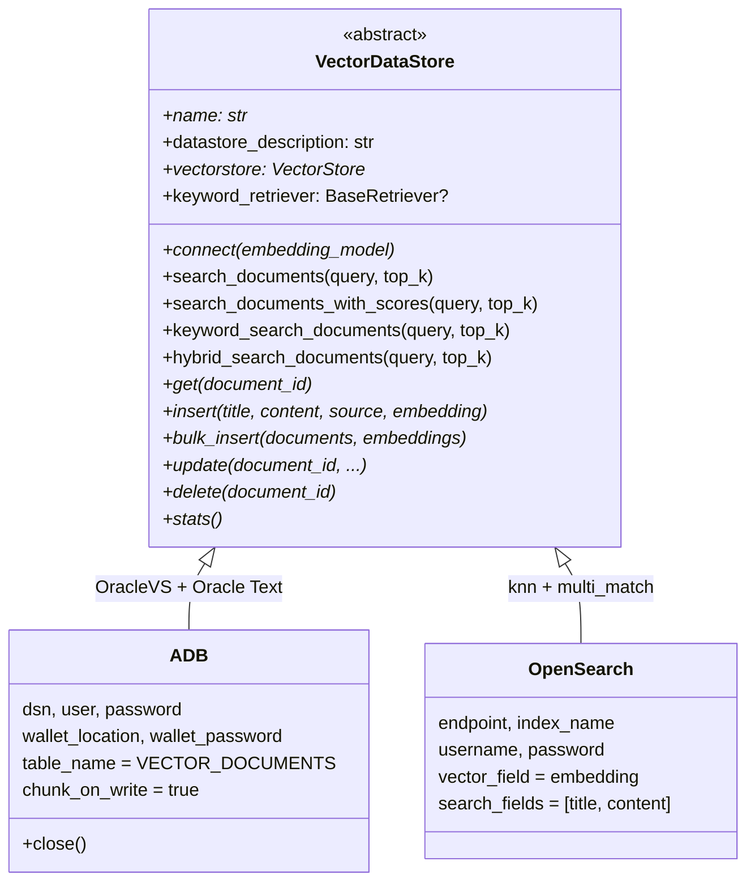
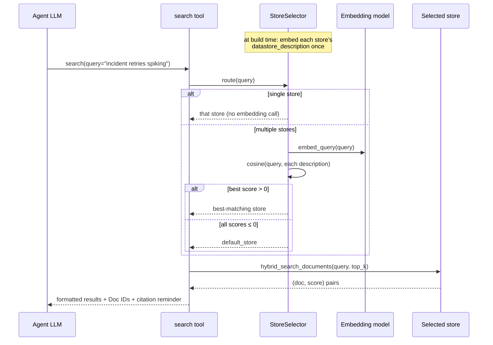

# Deep Agents on OCI — Datastores & Retrieval

Part of the [Deep Agents documentation](../../langchain_oci/agents/deepagents/README.md).
See also: [Core guide](guide.md) · [Persistence](persistence.md) · [Capabilities](capabilities.md) · [Operations](operations.md)

## The `VectorDataStore` contract



The ABC is built on standard LangChain contracts: implementations expose a
`VectorStore` for semantic search and optionally a `BaseRetriever` for keyword
search; all higher-level tooling works against those, never against
backend-specific APIs. Base-class provided behavior:

- `search_documents_with_scores` uses `similarity_search_with_score` when the
  vector store has it, else scores everything `0.0`.
- `keyword_search_documents` temporarily overrides the retriever's `k` to
  `top_k` and restores it after.
- `hybrid_search_documents` implements RRF (below) and **falls back to
  semantic-only** when the store has no keyword retriever.

## The ADB adapter (Oracle Autonomous Database / 26ai)

Built on `langchain_oracledb`: `OracleVS` (cosine distance,
`mutate_on_duplicate=True`), `OracleTextSearchRetriever` for keyword search,
and optionally `OracleTextSplitter` for server-side chunking.

**Constructor:**

| Field | Default | Notes |
|---|---|---|
| `dsn`, `user`, `password` | required | TNS alias or full descriptor |
| `wallet_location` | `None` | Expanded (`~` ok); used as both `config_dir` and `wallet_location` |
| `wallet_password` | `None` | **Defaults to `password`** when unset |
| `table_name` | `"VECTOR_DOCUMENTS"` | Must follow the OracleVS schema (`id`, `embedding`, `text`, `metadata`) |
| `datastore_description` | `""` | Routing text (see below) |
| `chunk_on_write` | `True` | Server-side chunking via `OracleTextSplitter` on ingest |
| `chunking_params` | `None` | Defaults to `{"split": "sentence", "max": 20, "normalize": "all"}` |

**Behavior contracts:**

- **Chunked documents round-trip.** With `chunk_on_write`, rows carry chunk IDs
  as primary keys; the *logical* document id lives in `metadata.id`.
  `get(document_id)` collects all rows where `JSON_VALUE(metadata,'$.id')`
  matches, sorts by `metadata.chunk_index`, and joins chunk texts with newlines
  — you get the whole document back.
- **A function-based index is auto-created** on `JSON_VALUE(metadata, '$.id')`
  at connect time (name `IDX_{table}_MID`, truncated to Oracle's 30-char cap).
  `ORA-00955` (already exists) is silently accepted; any other DDL failure logs
  a warning and lookups fall back to full scans — the store still works.
- **`update()` is delete-then-reinsert with snapshot recovery.** It snapshots
  the current document, deletes (which commits), re-ingests; if re-ingestion
  raises, it restores the snapshot and re-raises. There is a small window where
  a crash between delete and re-insert loses the row — treat updates as
  non-transactional.
- **`search()` scores are similarity** (`1 − cosine_distance`), content
  previews capped at 1,000 chars per hit.
- **`stats()`** returns row count plus top-10 sources grouped from
  `metadata.$.source` (falls back to a `SOURCE` column, then `{}`).
- **`close()` is idempotent** and the store is a context manager
  (`with ADB(...) as store:`). After `close()`, reconnect via `connect()`
  before reuse.
- Requires `oracledb` and `langchain-oracledb` — clear `ImportError`s name the
  missing package.

## The OpenSearch adapter

A minimal, self-contained adapter (no `langchain-community` dependency): an
internal `VectorStore` doing `knn` queries and an internal `BaseRetriever`
doing `multi_match` keyword queries.

**Constructor:**

| Field | Default | Notes |
|---|---|---|
| `endpoint`, `index_name` | required | |
| `username`, `password` | `None` | Basic auth when both set |
| `use_ssl` / `verify_certs` | `True` / `True` | |
| `vector_field` | `"embedding"` | knn field; always excluded from returned `_source` |
| `search_fields` | `["title", "content"]` | `multi_match` targets (`best_fields`, `fuzziness=AUTO`) |
| `datastore_description` | `""` | Routing text (see below) |

**Behavior contracts:**

- `connect()` pings the cluster (`client.info()`) — bad endpoints fail at build
  time. Timeout 30s, `RequestsHttpConnection`.
- **Document normalization** tolerates heterogeneous indices: content is taken
  from `content`, then `text`, then `metadata.content` (skipping values that
  look like JSON blobs); `title` falls back through `metadata.title` to
  `"Untitled"`; `source` falls back through `source_path` and metadata
  equivalents. You can point the adapter at an existing index that wasn't
  written by this SDK.
- **Writes are bulk with `refresh=true`** (immediately searchable). Per-item
  bulk failures are logged and **only the IDs that actually indexed are
  returned** — check the return length on `bulk_insert`.
- `add_texts` computes embeddings via the connected embedding model when not
  supplied, and validates ids/texts/metadatas/embeddings lengths match.
- `update()` is a partial-document update of only the provided fields;
  `delete()`/`get()` map OpenSearch 404s to `False`/`None`.
- `stats()` reads `indices.stats`: primary doc count + `size_bytes`.

## Writing a custom datastore

Subclass `VectorDataStore` and implement the abstract members (`name`,
`connect`, `vectorstore`, `get`, `insert`, `bulk_insert`, `update`, `delete`,
`stats`). Optionally expose `keyword_retriever` to unlock true hybrid search —
without it, `search` silently degrades to semantic-only. Set
`datastore_description` for routing. Your store then works everywhere
`ADB`/`OpenSearch` do, including `create_datastore_tools` and the agent
factory.

```python
from langchain_oci.datastores import VectorDataStore

class MyStore(VectorDataStore):
    @property
    def name(self) -> str:
        return "my_store"

    @property
    def datastore_description(self) -> str:
        return "product manuals, spec sheets"

    def connect(self, embedding_model):
        self._vs = ...  # any LangChain VectorStore

    @property
    def vectorstore(self):
        return self._vs

    # get / insert / bulk_insert / update / delete / stats ...
```

## The generated tools

`create_datastore_tools(...)` (also called internally by the agent factory)
returns exactly three tools:

| Tool | Name the LLM sees | What it does |
|---|---|---|
| `StatsTool` | `stats` | "START HERE" — document counts, descriptions, and backend extras per store (or one store via `store=`). Errors per store are embedded in the output rather than raised. |
| `HybridSearchTool` | `search` | Routes the query to one store, runs hybrid semantic+keyword search with RRF, formats results with Doc IDs, relevance scores, and 500-char content previews, plus an explicit *"ALWAYS cite Doc IDs"* instruction. |
| `GetDocumentTool` | `get_document` | Fetches the **full** document by ID. Takes an optional `store` argument; **does not route** — uses `default_store` unless told otherwise. Unknown stores/IDs return instructive error strings, not exceptions. |

Details that matter in practice:

- **Tool descriptions are composed at build time**: static description + usage
  hint + `"Available stores: name (description), …"` — so the LLM knows what
  stores exist without a tool call, but `stats` gives it live counts.
- **All tool errors return formatted strings**
  (`Error during hybrid search: …`) instead of raising — the agent loop keeps
  going and can self-correct.
- Two more tool classes are exported for manual composition but *not* included
  by the factory: `SearchTool` (semantic-only) and `KeywordSearchTool` (exact
  terms). Swap or add them if you build the tool list yourself:

```python
from langchain_oci.datastores import (
    KeywordSearchTool, SearchTool, StoreSelector, ResultFormatter,
)
```

- The tools are plain LangChain `BaseTool`s — they work with **any** agent
  (`create_oci_agent`, LangGraph, plain `bind_tools`), not just deepagents.

## Query routing (`StoreSelector`)



- Score threshold is `0.0`: any positive cosine similarity wins;
  ties/non-positive fall through to `default_store` (first dict key unless you
  set it).
- Descriptions are embedded **once** at build time; each routed query costs one
  query embedding.
- A store with an empty description is embedded under its **name** — always set
  `datastore_description`, and make descriptions distinct across stores
  (domain, document types, topics), e.g.
  `"incident reports, runbooks, error logs"` vs
  `"legal contracts, compliance policies"`.
- Routing picks exactly **one** store per query. The agent naturally covers
  multiple stores across research steps because each search call routes
  independently.

## Hybrid search (RRF)

For each `search` call against the routed store:

1. Fetch `2 × top_k` semantic hits (with scores) and `2 × top_k` keyword hits.
2. Fuse with Reciprocal Rank Fusion: `score(d) = Σ 1/(60 + rank + 1)` across
   both lists, deduplicating by document id (`doc.id`, else `metadata.id`,
   else a synthetic per-list key).
3. Return the top `top_k` by fused score.

No keyword retriever (custom stores) → semantic results returned directly. On
ADB the keyword leg is Oracle Text; on OpenSearch it's `multi_match` with
fuzziness.

## Embeddings

- **Default:** `OCIGenAIEmbeddings` with `cohere.embed-v4.0`, overridable via
  `$OCI_EMBEDDING_MODEL_ID` / `$OCI_EMBEDDING_MODEL`, built with the same
  compartment/endpoint/auth as the agent.
- **One model, three jobs:** routing, query-time search, and (for stores that
  embed on write) ingestion. **Index-time and query-time models must match** —
  and the embedding dimension must match your vector column.
- Pass any LangChain `Embeddings` implementation via `embedding_model=` to opt
  out of OCI entirely (relevant with BYO models — see
  [Operations](operations.md#bring-your-own-model)).
