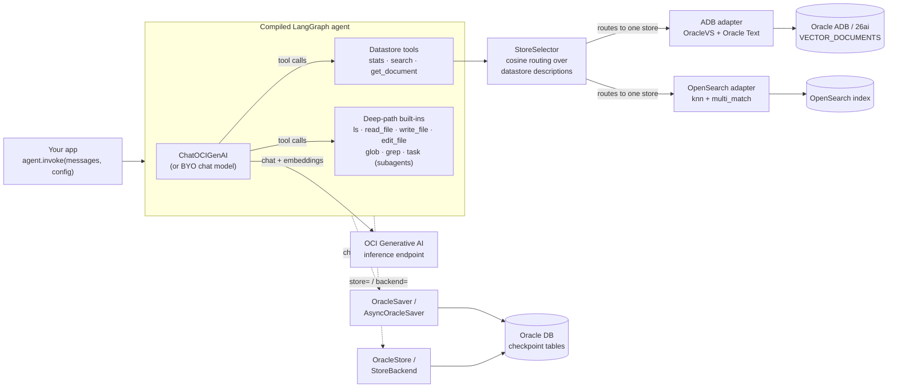
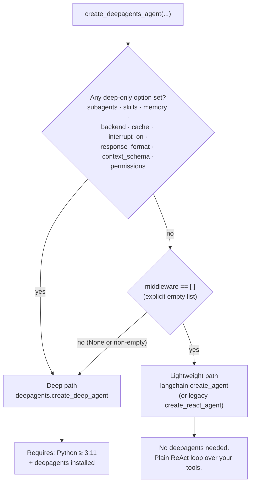
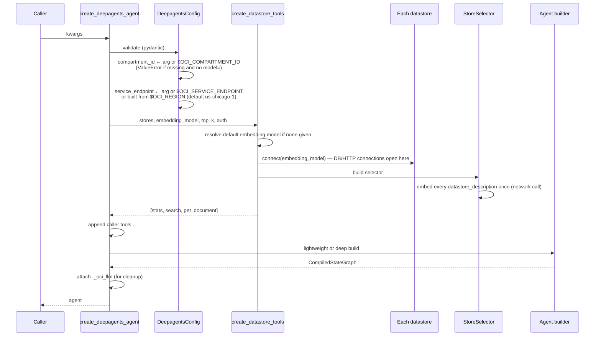

# Deep Agents on OCI — Core Guide

Part of the [Deep Agents documentation](../../langchain_oci/agents/deepagents/README.md).
See also: [Datastores & retrieval](datastores.md) · [Persistence](persistence.md) · [Capabilities](capabilities.md) · [Operations](operations.md)

`create_deepagents_agent(...)` builds a LangGraph agent for multi-step research
workflows on OCI: it wires an OCI GenAI chat model (or any LangChain chat model
you bring) to auto-generated retrieval tools over Oracle Autonomous Database and
OpenSearch vector stores, and — on the full path — to the `deepagents` harness:
planning, a virtual filesystem, subagents, skills, memory, and human-in-the-loop
controls.

## Architecture at a glance

Three layers, each usable on its own:

| Layer | Entry point | Use it alone when… |
|---|---|---|
| Agent factory | `create_deepagents_agent(...)` | you want the whole thing assembled |
| Datastore tools | `create_datastore_tools(...)` | you have your own agent (e.g. `create_oci_agent`) and just want the tools |
| Datastore adapters | `ADB(...)`, `OpenSearch(...)`, `VectorDataStore` | you want vector search primitives with no agent at all |

## The two build paths

`create_deepagents_agent` compiles one of two very different graphs. Which one
you get is decided by the config — and it changes which parameters take effect
and which packages must be installed.

**Rules, exactly as implemented:**

1. Any of `subagents`, `skills`, `memory`, `backend`, `cache`, `interrupt_on`,
   `response_format`, `context_schema`, `permissions` → **deep path**, always.
2. Otherwise, `middleware=[]` (an explicit empty list) → **lightweight path**.
   This is the only opt-out.
3. Everything else — including the default `middleware=None` and including
   datastore-only configs — → **deep path**. Datastores *compose with* the deep
   harness; they do not downgrade it.

**What differs per path:**

| | Lightweight | Deep |
|---|---|---|
| Underlying factory | `langchain.agents.create_agent` (falls back to `langgraph.prebuilt.create_react_agent` on old installs) | `deepagents.create_deep_agent` |
| Built-in tools | none — only your tools + datastore tools | filesystem (`ls`, `read_file`, `write_file`, `edit_file`, `glob`, `grep`), `task` (subagents), `execute` (errors unless a sandbox backend is configured) |
| Honors `interrupt_before` / `interrupt_after` | ✅ | ❌ silently unused |
| Honors `interrupt_on` | ❌ (forces deep path if set) | ✅ |
| Honors `middleware` | ✅ on the new `create_agent` API only | ✅ (inserted mid-stack, see [Capabilities](capabilities.md#structured-output-context-middleware)) |
| Requires `deepagents` package | no | yes (`ImportError` with install hint if missing; `RuntimeError` on Python < 3.11) |
| Conversation summarization | no | yes (built-in `SummarizationMiddleware`) |

> **Rule of thumb:** deploying on Python 3.9/3.10, or want a minimal ReAct
> tool-loop with no planning/filesystem overhead? Pass `middleware=[]`.
> Otherwise take the default.

> **Known issue (deepagents ≥ 0.7 + Gemini):** the 0.7.x built-in `grep`
> tool's schema contains `exclusiveMinimum` (from a `max_count` `gt=0`
> constraint), which Gemini's function-calling API rejects with a 400 —
> so the deep path currently fails on `google.gemini-*` models with
> `deepagents>=0.7` installed. Workarounds: use a non-Gemini model on the
> deep path (verified with `meta.llama-3.3-70b-instruct`), pin
> `deepagents<0.7`, or use the lightweight path with Gemini. See the
> [troubleshooting table](operations.md#troubleshooting).

## Construction lifecycle

Everything below happens **inside the factory call** — including network I/O.
Budget for it at startup, not per-request.

Consequences worth knowing:

- **Credentials are exercised at build time.** A bad wallet, DSN, or OpenSearch
  endpoint fails the factory call, not the first `invoke`.
- **Description embeddings are computed once** per store at build time and
  reused for every routed query.
- **`ADB.connect` opens a real `oracledb` connection** and keeps it; call
  `store.close()` (or use the store as a context manager) when tearing down.

## Complete parameter reference

### Datastores

| Parameter | Type / default | Behavior |
|---|---|---|
| `datastores` | `dict[str, VectorDataStore]` = `None` | Named stores. Presence generates the three datastore tools. Names are what the router and `get_document(store=...)` use. |
| `default_datastore` | `str` = `None` | Fallback store when routing is inconclusive. Defaults to the **first key** of `datastores`. |
| `default_store` | alias | Exact alias of `default_datastore` (both accepted; `default_store` wins if both are passed). |
| `embedding_model` | LangChain embeddings = `None` | Used for routing *and* store search. Default: `OCIGenAIEmbeddings` (see [Embeddings](datastores.md#embeddings)). |
| `top_k` | `int` = `5` | Results per `search` call. |

### Model

| Parameter | Type / default | Behavior |
|---|---|---|
| `model` | `BaseChatModel` = `None` | **Bring-your-own model.** Used as-is; `model_id` + all OCI inference auth options are ignored (see [Operations](operations.md#bring-your-own-model)). |
| `model_id` | `str` = `"google.gemini-2.5-pro"` | OCI GenAI model used to build a `ChatOCIGenAI` when `model` is not given. |
| `temperature` | `float` = `None` | Merged into the model kwargs. |
| `max_tokens` | `int` = `None` | Max output tokens. The provider layer remaps to `max_completion_tokens` for OpenAI-family models automatically. |
| `max_input_tokens` | `int` = `None` | **Accepted but ignored** — input limits are model-determined. Kept for signature compatibility. |
| `**model_kwargs` | any | Passed through to `ChatOCIGenAI(model_kwargs=...)`. |

### OCI auth (used for the built model and/or default embeddings)

| Parameter | Type / default | Behavior |
|---|---|---|
| `compartment_id` | `str` = `None` | Falls back to `$OCI_COMPARTMENT_ID`. **Required** unless `model=` is supplied (then only resolved opportunistically for datastore embeddings). `ValueError` otherwise. |
| `service_endpoint` | `str` = `None` | Falls back to `$OCI_SERVICE_ENDPOINT`, then `https://inference.generativeai.{$OCI_REGION or us-chicago-1}.oci.oraclecloud.com`. |
| `auth_type` | `str \| OCIAuthType` = `API_KEY` | One of `API_KEY`, `SECURITY_TOKEN`, `INSTANCE_PRINCIPAL`, `RESOURCE_PRINCIPAL` — enum or string. |
| `auth_profile` | `str` = `"DEFAULT"` | Profile in the OCI config file. |
| `auth_file_location` | `str` = `"~/.oci/config"` | OCI config file path. |

### Deep-agent options (all force the deep path except `system_prompt`/`middleware`)

| Parameter | Type / default | Behavior (details in [Capabilities](capabilities.md)) |
|---|---|---|
| `system_prompt` | `str` = `None` | Your instructions, placed first in the assembled system prompt (both paths). |
| `subagents` | `list` = `None` | `SubAgent` / `CompiledSubAgent` / `AsyncSubAgent` specs, invoked via the `task` tool. |
| `skills` | `list[str]` = `None` | Skill source paths (POSIX, relative to the backend root; last-wins on name clash). |
| `memory` | `list[str]` = `None` | `AGENTS.md`-style memory file paths, loaded at startup into the system prompt. |
| `middleware` | `Sequence` = `None` | `[]` → lightweight path. Non-empty → inserted between the deepagents base stack and tail stack. |
| `response_format` | schema = `None` | Structured output for the final answer. |
| `context_schema` | `type` = `None` | Immutable run-scoped context schema. |
| `permissions` | `list[FilesystemPermission]` = `None` | Path-level allow/deny/interrupt rules for the filesystem tools; first match wins. |

### LangGraph options

| Parameter | Path | Behavior |
|---|---|---|
| `checkpointer` | both | Thread-level state persistence — e.g. `OracleSaver` (see [Persistence](persistence.md)). |
| `store` | both | Cross-thread key/value + vector store — e.g. `OracleStore`. Required if `backend` uses `StoreBackend`. |
| `backend` | deep only | Storage backend for the deep agent's virtual filesystem — e.g. `StoreBackend`. |
| `cache` | deep only | LangGraph `BaseCache` for caching node results. |
| `interrupt_before` / `interrupt_after` | **lightweight only** | Node-name interrupt lists. |
| `interrupt_on` | **deep only** | `{tool_name: bool \| InterruptOnConfig}` human-in-the-loop gates. |
| `debug` | both | LangGraph debug mode (deep path: only forwarded when `True`). |
| `name` | both | Graph name. |

## Configuration & environment variables

Read by the **SDK** itself:

| Variable | Read when | Effect |
|---|---|---|
| `OCI_COMPARTMENT_ID` | `compartment_id` not passed | Compartment for inference + default embeddings |
| `OCI_SERVICE_ENDPOINT` | `service_endpoint` not passed | Full inference endpoint URL |
| `OCI_REGION` | neither endpoint given | Builds `https://inference.generativeai.{region}.oci.oraclecloud.com`; default `us-chicago-1` |
| `OCI_EMBEDDING_MODEL_ID` | default embedding model is built | Embedding model id (takes precedence) |
| `OCI_EMBEDDING_MODEL` | ″ | Same, lower precedence; final fallback `cohere.embed-v4.0` |

Used by the **samples and integration tests** only (conventions, not SDK
behavior): `OCI_AUTH_TYPE`, `OCI_AUTH_PROFILE`, `OCI_DEEPAGENTS_MODEL`,
`OCI_DEEPAGENTS_MAX_TOKENS`, `ADB_DSN`, `ADB_USER`, `ADB_PASSWORD`,
`ADB_WALLET_LOCATION`, `ADB_WALLET_PASSWORD`, `OPENSEARCH_ENDPOINT`,
`OPENSEARCH_USERNAME`, `OPENSEARCH_PASSWORD`, `OPENSEARCH_VECTOR_FIELD`,
`OPENSEARCH_SEARCH_FIELDS`, `OPENSEARCH_USE_SSL`, `OPENSEARCH_VERIFY_CERTS`.
