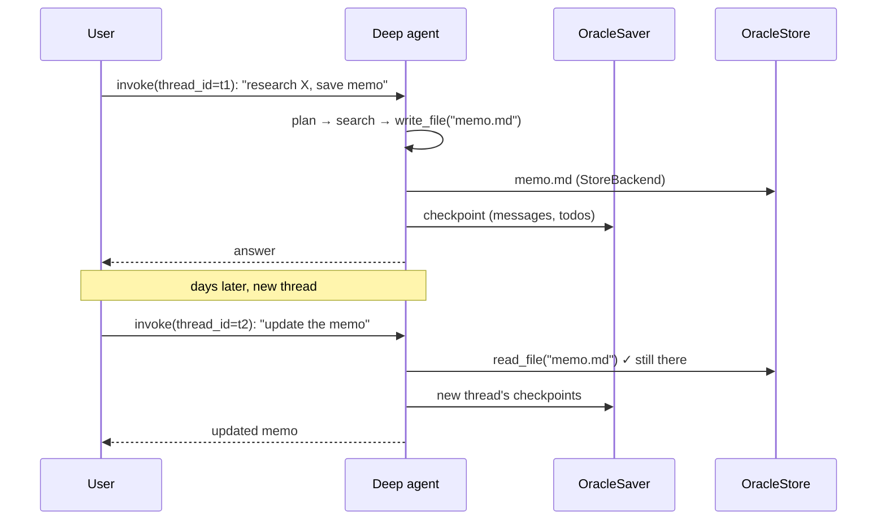

# Deep Agents on OCI — Persistence on Oracle

Part of the [Deep Agents documentation](../../langchain_oci/agents/deepagents/README.md).
See also: [Core guide](guide.md) · [Datastores & retrieval](datastores.md) · [Capabilities](capabilities.md) · [Operations](operations.md)

The `[deepagents]` extra ships
[`langgraph-oracledb`](https://pypi.org/project/langgraph-oracledb/) precisely
so agent state can live in the same Oracle database as your vectors. Three
independent knobs:

| Knob | Class | Persists | Scope |
|---|---|---|---|
| `checkpointer=` | `OracleSaver` / `AsyncOracleSaver` | Full graph state: messages, todos, virtual files | Per `thread_id` — resume, replay, time-travel |
| `store=` | `OracleStore` / `AsyncOracleStore` | Key/value namespaces (+ optional vector search) | Cross-thread, long-term |
| `backend=` | `deepagents.backends.StoreBackend` | The deep agent's virtual filesystem, backed by the `store` | Files survive across threads |

## Thread persistence with `OracleSaver`

```python
from langchain_oci import create_deepagents_agent
from langgraph_oracledb.checkpoint.oracle import OracleSaver

with OracleSaver.from_conn_string("USER/PASS@host:1521/FREEPDB1") as checkpointer:
    checkpointer.setup()  # one-time: creates checkpoint tables + migrations

    agent = create_deepagents_agent(
        datastores={"research": my_store},
        model_id="google.gemini-2.5-pro",
        compartment_id="ocid1.compartment.oc1..example",
        checkpointer=checkpointer,
    )

    cfg = {"configurable": {"thread_id": "research-42"}}
    agent.invoke({"messages": [{"role": "user", "content": "Start a lit review on X"}]}, cfg)
    # …later, same thread_id → full context, todos, and files restored:
    agent.invoke({"messages": [{"role": "user", "content": "Continue where we left off"}]}, cfg)
```

For wallet-authenticated ADB, build the connection yourself and pass it:

```python
import oracledb
from langgraph_oracledb.checkpoint.oracle import OracleSaver

conn = oracledb.connect(
    user="ADMIN",
    password="***",
    dsn="mydb_low",
    config_dir="/path/to/wallet",
    wallet_location="/path/to/wallet",
    wallet_password="***",
)
checkpointer = OracleSaver(conn)
checkpointer.setup()
```

`from_conn_string` also accepts `pool_config={"min_size": 1, "max_size": 10}`
for pooled connections. Async graphs use
`AsyncOracleSaver.from_conn_string(...)` with `await checkpointer.setup()`.

**Inspecting checkpoints:**

```python
for checkpoint in checkpointer.list(cfg):
    print(checkpoint.checkpoint["ts"], checkpoint.metadata)
state = agent.get_state(cfg)                   # current messages / todos / files
history = list(agent.get_state_history(cfg))   # time-travel
```

## Long-term memory with `OracleStore`

```python
from langgraph_oracledb.store.oracle import OracleStore

with OracleStore.from_conn_string("USER/PASS@host:1521/FREEPDB1") as store:
    store.setup()
    agent = create_deepagents_agent(..., store=store)
```

The store is available to middleware/tools via LangGraph's runtime and supports
namespaced key/value plus optional vector search — see the
[`langgraph-oracledb` README](../../../langgraph-oracledb/README.md) for index
configuration.

## A durable virtual filesystem with `StoreBackend`

By default the deep agent's files live in graph state (per-thread; persisted
only if you set a checkpointer). To make files durable and shared across
threads:

```python
from deepagents.backends import StoreBackend

agent = create_deepagents_agent(
    ...,
    store=oracle_store,        # StoreBackend reads/writes through this store
    backend=StoreBackend(namespace=lambda rt: ("agent-files",)),
)
```

The `namespace` factory (required since deepagents 0.7) receives the LangGraph
`Runtime` and returns the namespace tuple that scopes file storage — return a
per-user tuple (e.g. `(rt.context.user_id, "files")`) for per-user isolation,
or a constant for globally shared files.

Now `write_file`/`read_file` operate on Oracle-backed storage: a report written
in one thread is readable in the next. (`backend=` forces the deep path — see
[Core guide](guide.md#the-two-build-paths).)



A runnable version of this page lives at
[`samples/11-deepagents/persistence_oracle_example.py`](../../../../samples/11-deepagents/persistence_oracle_example.py).
